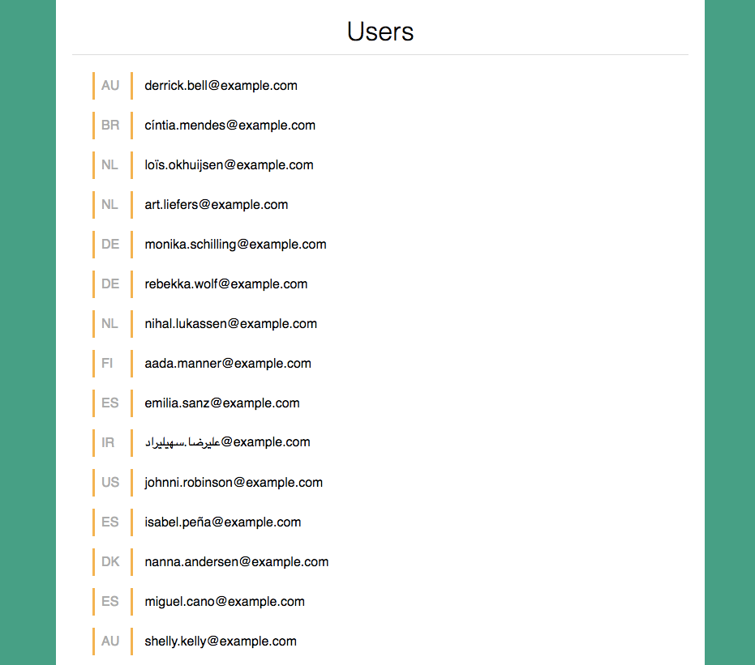
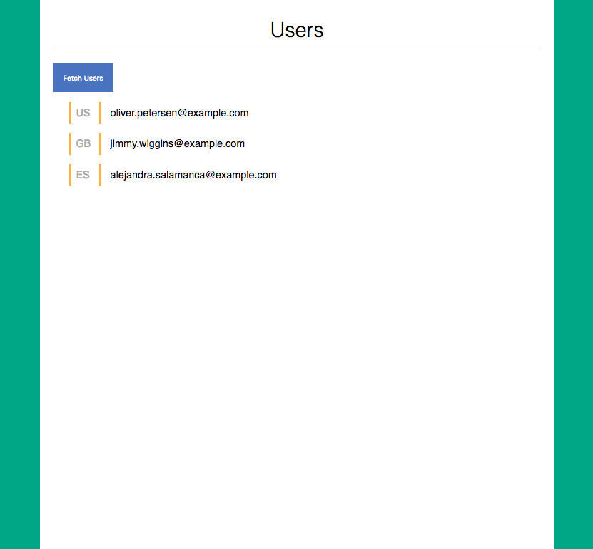

# JS - Async Fetch and Render

### The Demo


### Description
Use data from the [Random User API](https://randomuser.me/api/?results=50) and render each user from the results array inside of the `<div>` with a class of `users-list`.

To render properly, each element from the dataset should have the following structure:
```
  <article>
    <span>  «nat»  </span>
    <h6> «email»  </h6>
  </article>
```

You can see a demo in the `index.html`.

*NOTE* : The [superagent](https://github.com/visionmedia/superagent) promise library is already included. You will only need to:
1. make the request to the api.
  - https://randomuser.me/api/?results=50
2. access the returned data inside of the function passed to `.then(...)` promise-handler
3. format the returned data to a string that can be put on the DOM

### Setup
```sh
# 1- go to warmups
cd ~/Documents/muktek/warmups

# 2- clone this repo
git clone git@github.com:muktek/activity--async-fetch-and-render.git

# 3- open in the browser
cd activity--async-fetch-and-render

# Open index.html file in browser

# 4- open in atom and start work
atom .
```

### Notes
Data source:
https://randomuser.me/api/?results=50


### Extra
Use an event listener to trigger the fetching + rendering


